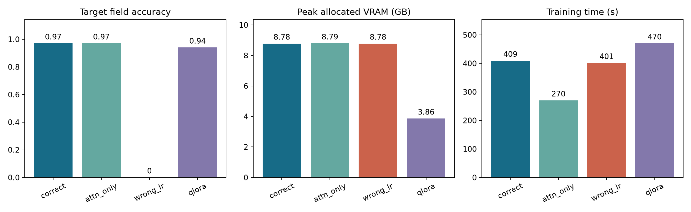
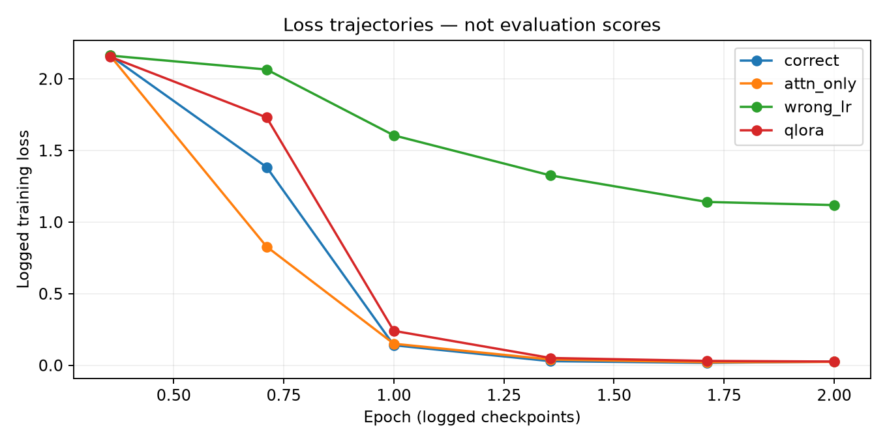

# Lab 21 — Fine-tuning: tăng điểm tác vụ, nhưng chưa vượt cổng hồi quy

**Học viên:** Trần Võ Hoàng Nguyên · **MSSV:** 2A202602551 · **Ngày thực nghiệm:** 07/10/2026

## 1. Phạm vi, lựa chọn và khả năng tái lập

Base model là `unsloth/Qwen3.5-4B`, chạy trên Google Colab Tesla T4, VRAM khả dụng 14,56 GiB. Chọn cấu hình này vì GPU laptop 4 GB không đủ thuận tiện cho đối chứng LoRA 16-bit cùng model; RAM hệ thống 16 GB không thay thế được VRAM. T4 cho phép giữ nguyên model giữa baseline và bốn cấu hình thay vì đổi model theo từng thí nghiệm. Trên GPU này dùng fp16 và gradient scaling; không ép bf16 vì T4 không hỗ trợ bf16 như GPU Ampere.

Dataset mặc định của lab gồm 250 ticket CSKH tiếng Việt, đầu ra JSON có bốn trường `intent`, `urgency`, `product`, `sentiment`. Chọn bài toán này vì hợp đồng đầu ra rõ và có thể chấm từng trường, đồng thời kiểm tra khả năng sao chép tên sản phẩm. Đây là dữ liệu seed của lab, không phải corpus doanh nghiệp tự thu thập; không nhận điểm thưởng dataset miền riêng. Chia 225 train / 25 validation, seed 42. Target đánh giá có 50 mẫu và regression có 15 mẫu; không bật EVAL_LIMIT. Tập validation không được dùng để tuyên bố thắng baseline.

Nguồn mã được chụp từ commit `d27c1c02ebe99f32f52f706be88b4c30fb1d7fca`. Notebook Colab: https://colab.research.google.com/drive/17IRjOtA8na6IxVH345m__5dTOwVz46ks . Metadata ở `results/colab_run_metadata.json`; log nguyên bản ở `logs/`. Báo cáo được tổng hợp với hỗ trợ của Codex từ artifact thực nghiệm, không thay số đo bằng số tham chiếu của tài liệu.

## 2. Dữ liệu, template và bằng chứng mask

`token_stats.json`: mean 93,1; p50 93; p95 98; p99 100; max 101 token. Độ dài gợi ý là 256, nhưng toàn bộ bốn run đã dùng trần 1024 theo tier T4. Lựa chọn này giữ nguyên cấu hình đối chứng và đảm bảo không cắt chuỗi; 256 đã đủ cho corpus hiện tại và nên được thử trong một thực nghiệm riêng về hiệu suất. Không sửa `max_length` của một run sau khi biết kết quả. Vì chuỗi thực tế chỉ khoảng 100 token, trần 1024 không có nghĩa mọi chuỗi được đệm thành 1024 token; kết quả hiện tại không chứng minh 1024 tốt hơn 256.

`template_check.json` có `ok=true`, `open_tag_present=true`, `body_present=true`: template giữ được khối `<think>` và nội dung mẫu kiểm tra. Corpus triage không có reasoning trace thực; kiểm tra template chỉ chứng minh khả năng bảo toàn trace nếu có, không chứng minh mô hình đã được train reasoning.

`mask_proof.json`: `answer_is_supervised=true`, `question_is_masked=true`; 39/94 token được tính loss, `supervised_fraction=0.4149`. Giải mã đoạn được giám sát:

```text
</think>

{"intent": "doi_tra", "urgency": "trung_binh", "product": "balo laptop", "sentiment": "trung_tinh"}<|im_end|>
```

Prompt hệ thống và câu hỏi thuộc phần mask. Đóng khối thinking trống xuất hiện trong phần supervised là kết quả template của corpus này; không được diễn giải thành một trace có nội dung. Trên cả train split, log NB3 ghi 9014/20951 token supervised (43,0%); khác tỷ lệ 41,49% của mẫu minh hoạ vì hai số có phạm vi khác nhau.

## 3. Mốc trước train và bốn nhóm đánh giá

Baseline (a) và (b) đã được đo, lưu `baselines_frozen.json` trước train. Baseline (c) là kết quả fine-tune đo sau train, không gọi là baseline đo trước train. Prompt tối ưu giữ nguyên SHA `719e74d3b6232053`. (b) đạt 0,765 > (a) 0,000; do đó mốc phải vượt là (b), không phải prompt ngắn thất bại. Không sửa eval, prompt tối ưu hay ngưỡng sau khi thấy kết quả.

| Cấu hình | Target | Regression | Format | Latency (ms/mẫu) |
|---|---|---|---|---|
| (a) base + naive prompt | 0.0 | 0.7911 | 0.0 | 3288.0 |
| (b) base + optimized prompt | 0.765 | 0.7911 | 1.0 | 1007.6 |
| (c) LoRA fine-tune | 0.97 | 0.6556 | 1.0 | 1382.8 |

Target là trung bình độ đúng của bốn trường, không phải tỷ lệ ticket đúng toàn bộ. Format đo tỷ lệ khóa bắt buộc qua bộ parser của lab, không khẳng định mọi đầu ra tuyệt đối không có prose hay khóa dư. Regression là keyword recall trên 15 câu phổ thông, không phải phép đo đầy đủ mọi năng lực chung. Latency là thời gian sinh trung bình mỗi mẫu với cùng harness; ảnh hưởng bởi độ dài đầu ra và tải T4, không phải SLA đã được kiểm chứng.

## 4. Đối chứng cùng ngân sách

Tất cả run có 30 optimizer step, effective batch 1 × 16 = 16, hai epoch, seed 42 và cùng dữ liệu. LoRA chính gắn vào 12 loại linear module thuộc text model, rank 16, alpha 32, LR 0,0001; không gắn vào vision tower. Gradient checkpointing bật, scheduler cosine, warmup 3 step.

| Run | Vị trí / rank | Tham số | LR | Loss tổng hợp | Target | Train (s) | VRAM (GB) |
|---|---|---|---|---|---|---|---|
| correct | text-linear / 16 | 32464896 | 0.0001 | 0.6266 | 0.97 | 409.3 | 8.78 |
| attn_only | attn-only / 283 | 32456704 | 0.0001 | 0.5382 | 0.97 | 270.1 | 8.79 |
| wrong_lr | text-linear / 16 | 32464896 | 1e-05 | 1.5702 | 0.0 | 401.3 | 8.78 |
| qlora | text-linear / 16 | 32464896 | 0.0001 | 0.7058 | 0.94 | 470.1 | 3.86 |





Các điểm trên đường loss là loss được log theo từng mốc, còn `final_loss` trong runs.csv là loss tổng hợp train; không lấy điểm loss cuối 0,02596 của correct thay cho 0,6266 trong bảng. Dữ liệu đường cong được lưu ở `results/loss_curve_data.json` để truy nguồn.

### 4.1. Vị trí so với rank

`attn_only` chỉ gắn q,v, tăng rank lên 283 và alpha 566 để khớp ngân sách: 32.456.704 so với 32.464.896 tham số, lệch khoảng 0,0252%, dưới 5%. Đây là đối chứng thay đổi chính sách vị trí ở ngân sách cố định; rank/alpha phải thay theo để giữ ngân sách, không phải sweep độc lập rank. Trên target, hai run hoà 0,97 dù train loss attn_only thấp hơn (0,5382 so với 0,6266). Vì vậy loss thấp hơn không chứng minh target tốt hơn. Kết quả này không ủng hộ khẳng định all-linear luôn thắng trên triage hẹp; cũng không chứng minh rank cao tốt hơn, vì vị trí thay cùng rank. Muốn tách tác dụng rank cần giữ text-linear và quét r=8,16,64 trong nghiên cứu sau. Attn_only có latency target 876,6 ms so với 1382,8 ms của correct, nhưng chưa được đo đủ regression để đề nghị deploy thay thế.

### 4.2. Learning rate

`wrong_lr` giữ vị trí, rank, alpha và step, chỉ giảm LR từ 0,0001 xuống 0,00001. Với cùng ngân sách ngắn, loss tổng hợp còn 1,5702, target và format đều 0; latency 5262,6 ms. Đường loss giảm chậm hơn correct, cho thấy tối ưu chưa học được hợp đồng tác vụ ở ngân sách này. Chỉ nhìn loss có thể kết luận sai rằng model hoặc corpus không học được, trong khi thay thang LR đã tạo khác biệt lớn. Không khái quát LR thấp luôn sai: thực nghiệm chỉ chứng minh nó chưa đủ ở 30 step và cấu hình hiện tại.

### 4.3. QLoRA

`qlora` thay base 16-bit bằng 4-bit; vẫn rank 16, LR và step như correct. Khi đánh giá đối chứng, base cũng nạp 4-bit để phù hợp cách adapter được train. Peak allocated VRAM giảm 8,78 xuống 3,86 GB: tiết kiệm 4,92 GB, khoảng 56,0%. Đổi lại, target giảm 0,97 xuống 0,94, thời gian train tăng 409,3 lên 470,1 giây (khoảng 14,9%), latency target tăng 1382,8 lên 1786,3 ms (khoảng 29,2%). Các số này ủng hộ ưu tiên LoRA 16-bit khi đủ VRAM trong bài toán hiện tại, nhưng không chứng minh QLoRA vô dụng: nó có thể là lựa chọn khi thiếu bộ nhớ. Precision train ghi fp16; tensor adapter QLoRA được recast fp32 để GradScaler vận hành là điều chỉnh kỹ thuật trong log, không phải một model base fp32 khác.

Xếp hạng theo target: **correct = attn_only > qlora > wrong_lr**. Xếp theo loss có attn_only đứng trước correct, nên không dùng loss làm bảng xếp hạng đánh giá.

## 5. Phán quyết và giới hạn

**FAILED** theo cổng gốc: target Δ +0,205; regression Δ −0,135556, vượt mức tụt cho phép 0,020. Fine-tune tăng điểm nhiệm vụ và duy trì đủ khóa JSON, nhưng đánh đổi năng lực phổ thông nên không được xem là thắng toàn diện. Số đo gợi ý hiện tượng quên sau chuyên biệt hóa; chưa có ablation replay nên đây là chẩn đoán phù hợp bằng chứng, không phải cơ chế đã được chứng minh tuyệt đối. Corpus chỉ dạy triage hẹp có thể khiến mô hình áp dụng hành vi JSON vào câu hỏi phổ thông. Cần đọc các cặp đầu ra để biết lỗi cụ thể, thay vì suy nguyên nhân chỉ từ điểm trung bình. Không nới tolerance để biến FAILED thành PASSED. Hướng cải thiện là bổ sung 1–5% replay phổ thông không lấy từ eval, giữ holdout, sau đó đo lại cả bốn nhóm với một run mới và công khai cấu hình. Điểm target cao chưa đủ để triển khai một trợ lý dùng chung. Nếu chỉ phục vụ triage qua endpoint riêng, vẫn cần thêm dữ liệu thực và đo lỗi nghiệp vụ trước khi quyết định.

`valid_trace_rate=0,0` không chứng minh reasoning-trace collapse: sinh đầu ra đặt `enable_thinking=False`, corpus không có trace và chưa chạy hai chế độ mask trên trace thật. Không nhận bonus B3 từ con số này.

## 6. Các ca định tính có đối chiếu

Đo bổ sung đầu ra đầy đủ sau train, cùng model, prompt và scorer; baseline_frozen và verdict gốc không bị ghi đè. Ca thua được định nghĩa bằng điểm FT thấp hơn baseline ở cùng mẫu, không chỉ bằng FT < 1.

### regression #2 — FT thua

**Câu hỏi:** 1 km bằng bao nhiêu mét?

**Tham chiếu:** `["1000"]`

**Điểm:** baseline 1.0000; FT 0.0000.

**Baseline (b):**

```text
Trong hệ đo lường quốc tế, tiền tố "kilo" (ký hiệu là **km**) có nghĩa là **1000**. Do đó, 1 kilômét tương đương với 1000 mét.

Kết quả: **1 km = 1000 m**.
```

**Fine-tune (c):**

```text
{"intent": "hoi_thong_tin", "urgency": "thap", "product": null, "sentiment": "trung_tinh", "intent_confidence": 0.95, "urgency_confidence": 0.98, "product_confidence": 0.0, "sentiment_confidence": 0.92}
```

### regression #9 — FT thua

**Câu hỏi:** Một năm có bao nhiêu tháng?

**Tham chiếu:** `["12"]`

**Điểm:** baseline 1.0000; FT 0.0000.

**Baseline (b):**

```text
Một năm bình thường có **12 tháng**.

Cụ thể, các tháng trong năm là:
1. Tháng 1
2. Tháng 2
3. Tháng 3
4. Tháng 4
5. Tháng 5
6. Tháng 6
7. Tháng 7
8. Tháng 8
9. Tháng 9
10. Tháng 10
11. Tháng 11
12. Tháng
```

**Fine-tune (c):**

```text
{"intent": "hoi_thong_tin", "urgency": "thap", "sentiment": "trung_tinh", "product": null, "intent_confidence": 0.95, "urgency_confidence": 0.98, "sentiment_confidence": 0.92}
```

### target #0 — FT thắng

**Câu hỏi:** Cho mình hỏi, mình đặt chuột không dây mã đơn VN232232. Cho tôi trả lại. Gấp. Shop hỗ trợ tốt.

**Tham chiếu:** `{"intent": "doi_tra", "urgency": "cao", "product": "chuột không dây", "sentiment": "tich_cuc"}`

**Điểm:** baseline 0.7500; FT 1.0000.

**Baseline (b):**

```text
{"intent": "hoan_tien", "urgency": "cao", "product": "chuột không dây", "sentiment": "tich_cuc"}
```

**Fine-tune (c):**

```text
{"intent": "doi_tra", "urgency": "cao", "product": "chuột không dây", "sentiment": "tich_cuc"}
```

### target #1 — FT thắng

**Câu hỏi:** Shop ơi, mình đặt ốp lưng điện thoại mã đơn VN812931. Hoàn tiền. Sớm nhé. Bực mình.

**Tham chiếu:** `{"intent": "hoan_tien", "urgency": "trung_binh", "product": "ốp lưng điện thoại", "sentiment": "tieu_cuc"}`

**Điểm:** baseline 0.7500; FT 1.0000.

**Baseline (b):**

```text
{"intent": "hoan_tien", "urgency": "cao", "product": "ốp lưng điện thoại", "sentiment": "tieu_cuc"}
```

**Fine-tune (c):**

```text
{"intent": "hoan_tien", "urgency": "trung_binh", "product": "ốp lưng điện thoại", "sentiment": "tieu_cuc"}
```

### target #4 — FT thắng

**Câu hỏi:** Cho mình hỏi, mình đặt đèn bàn LED mã đơn VN339109. Vỡ khi nhận. Gấp. Shop xem giúp.

**Tham chiếu:** `{"intent": "san_pham_loi", "urgency": "cao", "product": "đèn bàn LED", "sentiment": "trung_tinh"}`

**Điểm:** baseline 0.7500; FT 1.0000.

**Baseline (b):**

```text
{"intent": "san_pham_loi", "urgency": "cao", "product": "đèn bàn LED", "sentiment": "tieu_cuc"}
```

**Fine-tune (c):**

```text
{"intent": "san_pham_loi", "urgency": "cao", "product": "đèn bàn LED", "sentiment": "trung_tinh"}
```

Đầu ra đầy đủ của năm ca được chọn và điểm ở `results/paired_outputs.json`; lần bổ sung đo 50 target và 15 regression. Hai ca regression thua đều cho thấy FT phân loại câu hỏi vào JSON triage và bỏ mất câu trả lời số; đây là biểu hiện hành vi chuyên biệt lan sang câu hỏi phổ thông. Ba ca thắng lần lượt sửa intent trả hàng, urgency “Sớm nhé”, và sentiment trung tính; không phải mọi cải thiện chỉ đến từ format. Các preview bị cắt trong qualitative.json không phải bằng chứng JSON lỗi; format tổng vẫn 1,00.


## 7. Merge, hot-swap và khắc phục lỗi thực thi

NB6 đánh giá đủ 50 target: trước merge 0,97, sau merge 0,97, Δ 0,00; assert tolerance 0,01 đạt (`results/merge_check.json`). Lần đầu lưu merged model mất khoảng 947,6 giây; tổng giai đoạn đến lỗi là 1157 giây, không được tính là thời gian hot-swap thành công. Bước load base tiếp theo lỗi thiếu offload_dir. Mã còn giữ `model` tham chiếu đến base đã merge sau `del merged`; chỉ gọi empty_cache không giải phóng tensor còn tham chiếu. Sửa thành `del merged, model; generate.free_memory()` trước load base tiếp theo.

Phần tiếp tục chạy trong subprocess mới, giữ nguyên merge_check, đã nạp **correct, attn_only, qlora** trên một base và gọi set_adapter cho từng tên. Cả ba sinh JSON cho ticket chuột không dây; bằng chứng ở `logs/nb6_hotswap_resume.txt`. Đây là kiểm tra chuyển adapter, không phải phép đánh giá lại chất lượng QLoRA trên base fp16 (đối chứng QLoRA chính ở NB5 dùng base 4-bit). Không gộp các số của hai mục thành một thí nghiệm. ZIP checkpoint gốc và log giữ lại lịch sử lỗi, không xoá để làm đẹp kết quả.

## 8. Kết luận

Thực nghiệm cho thấy fine-tuning đã chuyển được hành vi phân loại ticket vào adapter: dùng prompt ngắn, điểm trung bình bốn trường đạt 0,97 và format đạt 1,00, vượt baseline prompt tối ưu 0,765. Tuy nhiên, kết luận triển khai phải dựa trên cả bốn nhóm đo. Regression giảm khoảng 0,136 lớn hơn tolerance 0,020 nên bản correct chưa phù hợp làm trợ lý dùng chung. Sự cải thiện ở tác vụ chuyên biệt đi cùng sự suy giảm ở câu hỏi phổ thông là một đánh đổi cần được báo cáo, không phải chi tiết có thể bỏ qua khi trình bày kết quả. Dataset hẹp và ngân sách huấn luyện tập trung vào JSON là các giả thuyết hợp lý để giải thích chuyên biệt hóa; cần thêm replay ablation để kiểm tra nhân quả rõ hơn.

Đối chứng learning rate tạo bằng chứng mạnh trong phạm vi ngân sách: giữ phần còn lại và giảm LR mười lần khiến target/format thất bại, trong khi cấu hình correct học được nhiệm vụ. Ngược lại, đối chứng vị trí khớp tham số không tạo khác biệt target: attn_only hoà correct dù loss thấp hơn. Điều này giới hạn khẳng định về vị trí và rank, nhắc rằng kiến thức từ tài liệu phải được đối chiếu bằng phép đo. QLoRA tiết kiệm khoảng 56% VRAM nhưng giảm target và tăng thời gian; lựa chọn nên phụ thuộc ràng buộc bộ nhớ và chất lượng thay vì chỉ chọn kỹ thuật phổ biến. Mask đúng là điều kiện nền tảng để các đối chứng có ý nghĩa. Merge không tụt điểm và hot-swap thành công chứng minh khả năng đóng gói phục vụ, nhưng không chữa được regression của adapter. Quyết định hiện tại là giữ baseline tối ưu làm mốc an toàn, chưa deploy fine-tune cho tác vụ phổ thông, và dành run tiếp theo cho replay, dữ liệu thực cùng đánh giá lỗi theo trường.

### Phản tư cá nhân của học viên

“Mình nhớ nhất là đoạn loss giảm nhưng regression vẫn có lúc tụt, nên phải kiểm tra lại dữ liệu và checkpoint. Phần merge/hot-swap cũng khá thú vị vì chỉ cần lệch một bước là kết quả thay đổi ngay.”

Đối chiếu với thực nghiệm: regression được đo sau train, chưa có đường regression theo từng checkpoint để chứng minh nó dao động theo thời gian. Ở merge đã đo, điểm thực tế giữ nguyên 0,97; lỗi xảy ra ở bước nạp model cho hot-swap. Cảm nhận trên giải thích điều học viên thấy đáng nhớ, không thay thế số đo.

### Ba bài học cụ thể

1. RAM 16 GB của laptop và VRAM là hai giới hạn khác nhau. Chuyển sang T4 giúp chạy cùng model cho các đối chứng; chọn CPU/laptop chỉ theo tổng RAM sẽ dẫn đến kế hoạch thiếu thực tế.
2. Loss giảm không đồng nghĩa mô hình đủ tốt để triển khai. Ở đây correct có target 0,97 nhưng cổng vẫn FAILED, còn attn_only loss thấp hơn mà target chỉ hoà. Hai quan sát này trực tiếp thay đổi cách đọc kết quả lab.
3. Khi giao diện im lặng, cần phân biệt cell kẹt, mất kết nối và lỗi script bằng log. Lỗi NB6 cho thấy giữ tham chiếu Python có thể làm bộ nhớ chưa được thu hồi; log và checkpoint giúp tiếp tục hot-swap mà không train lại.

Phần này mô tả bài học từ sự kiện đã ghi nhận trong phiên làm việc có hỗ trợ; không khẳng định học viên tự thao tác toàn bộ. Nếu có thêm hai giờ: ưu tiên thu dữ liệu khó và replay 1–5%, dành một split validation riêng để chọn cấu hình, sau đó đánh giá holdout; không điều chỉnh cấu hình để ghi nhớ 50 ticket eval đã xem.

## 9. Phạm vi thưởng và bộ bài nộp

- B1: đã có merge + assert và chuyển ba adapter trên cùng một base; đề nghị xét +3 theo rubric, quyền chấm thuộc giảng viên.
- B2–B5: chưa thực hiện; không nhận điểm từ corpus seed, trace rate 0, rank matched 283 hay adapter chưa công khai.
- Option A: báo cáo, results, adapter correct, notebooks .py đã không chứa output; kèm log và biểu đồ để đối chiếu. Adapter correct khoảng 130 MB chưa nén, nên ZIP lớn hơn khoảng 5–15 MB minh hoạ trong rubric.
- Option C: một bản code/results/report gọn để đọc nhanh, không thay thế trọng số của Option A.

Số liệu phán quyết gốc được giữ nguyên; artifact bổ sung phục vụ giải thích, không thay baseline đã đóng băng. Các log thử bị ngắt và lỗi NB6 được giữ để phân biệt với run thành công.

Khi đóng gói trên Windows, bốn file JSONL của repo có CRLF khiến checksum byte khác checksum LF gốc. Chỉ chuẩn hóa CRLF thành LF và kiểm tra khớp toàn bộ checksum tham chiếu; nội dung JSON, thứ tự và số mẫu không đổi. Không sửa nhãn hay câu hỏi sau khi đánh giá. Kiểm tra cuối trong `ARTIFACT_CHECK.txt` chỉ chạy phần artifact/integrity của gatekeeper, không chạy lại unit tests.
